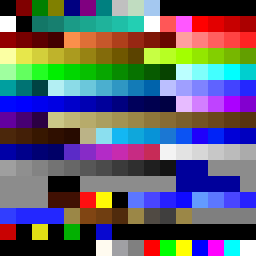
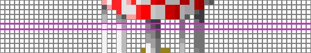
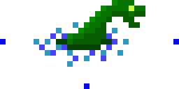

# SimCity 2000 Sprite Format

This document describes the format of the SimCity 2000 `dat` files that contain sprite data (some `dat` files contain other types of information). All integers are unsigned and stored in big-endian order.

## Color Palette

SimCity 2000 sprites use this color palette:



Although presumably contained within the game's executable, this palette also appears in `C:/Program Files/Maxis/SimCity 2000/Bitmaps/PAL_MSTR.BMP` (which was used to generate the palette image above; see [this script](../scripts/sc2k-make-palette-image.py)).

Of note is that `C:/Program Files/Maxis/SimCity 2000/Bitmaps/PAL_STTC.BMP` contains the same palette, but with the colors used for [color cycling](https://en.wikipedia.org/wiki/Color_cycling) animation set to black. Presumably "STTC" means "static".

# File Sections

## Sprite Count

Quantity: 1

Offset | Type | Length | Description
---|---|---|---
0 | Int | 2 | Number of sprites in the file (N<sub>sprites</sub>)

## Sprite Definition

Quantity: N<sub>sprites</sub>

Each definition is 10 bytes long.

The offsets below are relative to the start of each definition.

Offset | Type | Length | Description
---|---|---|---
0 | Int | 2 | ID
2 | Int | 4 | Absolute offset of this sprite's data in the file
6 | Int | 2 | Height (number of rows)
8 | Int | 2 | Width (number of columns)

## Sprite Data

Quantity: N<sub>sprites</sub>

Each sprite begins at the absolute offset specified in its definition.

Sprite data is composed of a sequence of blocks. Each block starts with two values:

Offset | Type | Length | Description
---|---|---|---
0 | Int | 1 | Count (meaning varies with block type)
1 | Int | 1 | Block type

There are five block types:

Block Type | Description
---|---
0 | Empty block with no associated data or action. It can be ignored. It's unclear why these blocks exist. Perhaps they're padding to align with word boundaries or they mark the start and/or end of groups of pixels with some significance to the game.
1 | Marks the start of a row. The count specifies the start of the next row as a relative offset from the block type byte.
2 | Marks the end of a sprite.
3 | Indicates that pixels in the current row should be skipped (i.e., left transparent). The number of pixels to skip is specified by the count value.
4 | Contains pixel data (indices into the 16x16 SimCity 2000 color palette). The number of pixels is specified by the count value.

All blocks except those of type 4 have a length of two bytes (containing their count and type values).

### Type 4 Blocks

Type 4 blocks have the following structure (offsets are relative to the start of the block):

Offset | Type | Length | Description
---|---|---|---
0 | Int | 1 | Count (N<sub>pixels</sub>)
1 | Int | 1 | Block type
2 | Byte | 1 | Color of pixel (palette coordinates as two four-bit integers; see below); repeats N<sub>pixels</sub> times
... | | | Additional pixel colors (if present)
2+N<sub>pixels</sub> | Byte | N/A | Null byte (only present if N<sub>pixels</sub> is odd)

For example, a type-4 block containing three pixels would have a length of 2 (count and type) + 3 (pixels) + 1 (null byte) = 6 bytes.

Each pixel's color is specified by a single byte that provides the coordinates of a color in the 16x16 palette. The lower four bits of this byte give the column index and the upper four bits give the row index. Indices are zero-based.

For example, a value of 0x53 = 83 = 0b0101_0011 corresponds to the color at column 3 (`83 & 15`), row 5 (`83 >> 4`) in the palette.

### Example

Here are the byte values (in hexadecimal) defining the 28th row of the water tower sprite (blocks are delimited using `|`):
```
26 01 | 15 03 | 01 04 9A 00 | 02 03 | 00 00 | 02 04 9A A0 | 04 03 | 00 00 | 03 04 A2 A5 A7 00 | 04 03 | 01 04 A3 00 | 02 03 | 00 00 | 02 04 A3 A3
```



This sequence breaks down as follows:
* `26 01`: The start of a new row. The next 0x26 (38) bytes define this row.
* `15 03`: Skip the first 0x15 (21) columns of this row.
* `01 04 9A 00`: Draw one pixel. Its color is the one at column 10 (`154 & 15`), row 9 (`154 >> 4`) in the palette. Note that since the count (1) is an odd number, this block is padded with a null byte.
* `02 03`: Skip the next two columns of this row.
* `00 00`: Ignore.
* `02 04 9A A0`: Draw two pixels. Since this block's count (2) is even, no extra null byte is required.
* `04 03`: Skip four columns.
* `00 00`: Ignore.
* `03 04 A2 A5 A7 00`: Draw three pixels. Note extra null byte.
* `04 03`: Skip four columns.
* `01 04 A3 00`: Draw one pixel. Note extra null byte.
* `02 03`: Skip two columns.
* `00 00`: Ignore.
* `02 04 A3 A3`: Draw two pixels.

### Bonus

Here's the rarely-seen Nessie sprite:

